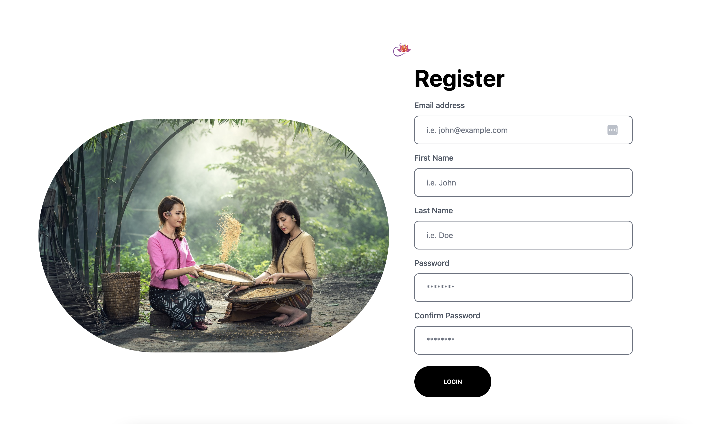
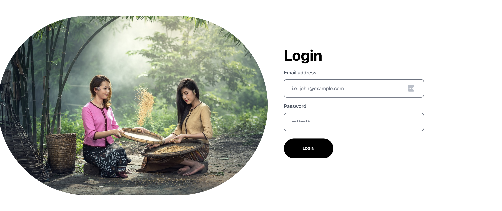
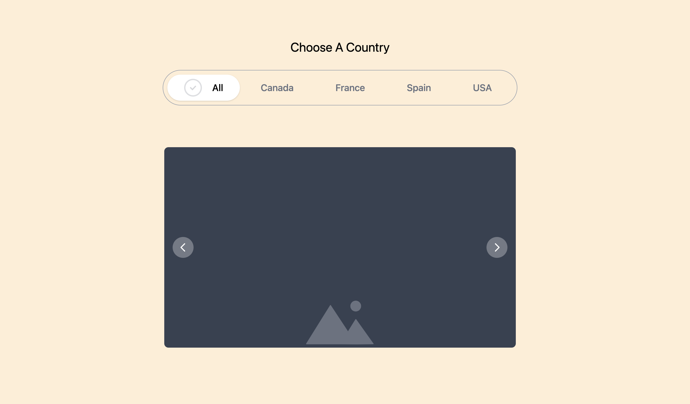

# Uberflip Fullstack Candidate Coding Assignment

Congratulations, you have been asked to complete our Full Stack candidate proficiency assignment!

You will have **3 days** starting when you receive this test to return the full working source code as a Pull Request against a fork of this repository. Please thoroughly read the attached set of instructions. You will be creating a mini web app that uses React, Node, Express, Typescript, Tailwindcss, Jest and Postgres. This app will consist of a backend Express server that will respond to front end requests made by a frontend React app.

## Task Requirements

1. You are required to write the code on the Register page that makes a request to your Register API endpoint. This request will register a user with a valid:
   Email, First Name, Last Name, and Password. Password must be encrypted in the database.

   

2. Next, you are required to write the code for the Login page that makes a request to your Login API endpoint. This request will allows the user to recieve a jwt token. This jwt token is required for a user to make requests to other protected API endpoints, for example the Countries API.

   

3. a. If a user is logged in, the Countries page should make a request to your Countries API endpoint to retrieve a countries list. Once the countries list has been retrieved, the first image should be shown. The user should now be able to cycle through the photos using left and right arrow buttons.

   b. The user can use country filter UI to toggle between 'Canada', 'France', 'Spain', 'USA' and 'All'. After each filter change for the selected country list, a loading state should be shown and a new request to the countries API endpoint should be made which will return a list of the selected country.

   

4. Unit tests

- write a unit test for one of the API end points on the backend
- write a unit test for one of the components in the components folder on the frontend.

If you have any questions, require further details or get stuck please do not hesitate to contact us.

#### Do's

- Be RESTful
- ES6+
- Use JS best practices
- Use any one of the Bcrypt & JWT Token libaries for authentication

#### Don'ts

- For the carousel don't use a third party library
- Don't over think the problem, there's no trick here

#### Bonus

- More Unit tests
- Modify app structure

## SETUP INSTRUCTIONS

#### About The Starter Files

- This assignment uses Docker to help pre-load a database with data. Ensure that your machine can run the docker engine at a minimum. Alternatively, the `/seeds` folder contains SQL scripts to seed a local Postgres database.
- Node Expressjs app is initialized in the `/backend` folder.
- Create React App is also initialized in the `/frontend` folder.

### Getting Started

- Fork or clone this repository.
- Run `docker-compose build` to build your docker environment.
- Use `docker-compose up` to enable your environment. This will start your Express server and a Postgres database. _Note_: If you don't want to constantly rebuild your image, you can run the client and server outside of docker for development.
- The Postgres database will be pre-loaded with two tables. The `users` table contains a table of users. The `countries` table contains contains list with image urls.
- Complete the assignment in a separate branch.

##### Frontend:

- On your local host environment, react app will be available on port `localhost:3000`.
  - Register page is `localhost:3000/`
  - Login page is `localhost:3000/login`
  - Countries page is `localhost:3000/countries`

##### Backend:

- On your local host environment, express app will be available on port `localhost:5000`.
  - Login Api is `localhost:5000/login`
  - Register page is `localhost:5000/register`
  - Countries page is `localhost:5000/countries/:country`

##### Database:

- On your local host environment, the Postgres docker image will be available on port `localhost:5435`. Within the docker network, the database is located on `postgres:5432`.

  ##### Postgress DB info

  - POSTGRES_USER: user
  - POSTGRES_PASSWORD: password
  - POSTGRES_DB: myapp

#### Database Table

##### Users table

- id SERIAL PRIMARY KEY,
- first_name VARCHAR(50) NOT NULL,
- last_name VARCHAR(50) NOT NULL,
- email VARCHAR(255) UNIQUE NOT NULL,
- password VARCHAR(255) NOT NULL,
- created_at TIMESTAMP NOT NULL DEFAULT NOW(),
- modified_at TIMESTAMP NOT NULL DEFAULT NOW(),
- verified BOOLEAN NOT NULL DEFAULT FALSE

##### Countries table

- id SERIAL PRIMARY KEY,
- country_name TEXT NOT NULL,
- city TEXT NOT NULL,
- image_url TEXT NOT NULL,
- featured BOOLEAN NOT NULL DEFAULT FALSE,
- created_at TIMESTAMP DEFAULT NOW()  

If you are having trouble setting up the docker environment, feel free to use the scripts to load a local database and develop locally.

## Submission

There are several ways to submit your completed assignment:

#### PR Method (Preferred)

- Create a PR for `your new branch` -> `main` **in your own repository**
- Do not PR in this repository
- Email you manager with a link to the PR

#### Zip Method

- Zip your completed code
- Email it to your manager
